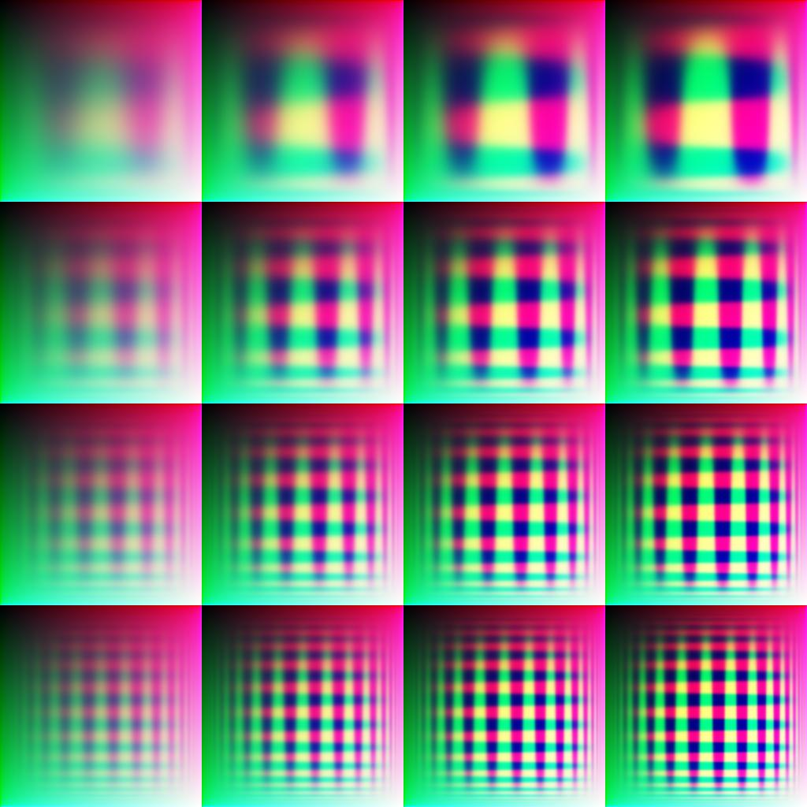

# imagegen-cuda-clj

A proof-of-consept project using CUDA via [uncomplicate.clojurecuda](https://github.com/uncomplicate/clojurecuda)
to generate a BufferedImage. I'll be using this as a starting point for future projects, and trying to figure
out what is the best way of handling these GPU resources and contexts.

